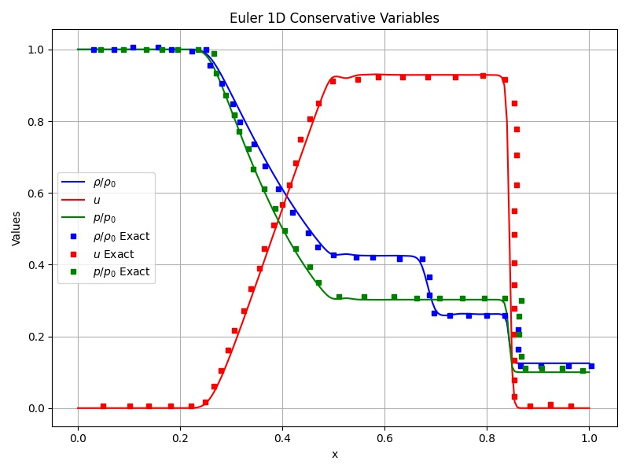

# ShockFXM++

1D Shock Tube simulator demonstrating the use of SplitFXM++

## What does 'split' mean?
The user is directed to [SplitFXM](https://raw.githubusercontent.com/gpavanb1/SplitFXM/refs/heads/main/README.md) README for further details and documentation

## How to install and execute?

This can be most easily used with VSCode. There is a `tasks.json` that contains the build and run commands that can be invoked directly from the IDE.

The driver program is in `main.cpp` which can be compiled and executed using Bazel.

### Prerequisites (macOS 26.0+)
The build system is configured for macOS 26.0 on Apple Silicon. It requires:
* **LLVM 14+**: Installed via Homebrew (`brew install llvm`).
* **Bazel**: For building and dependency management.

### Installation
Clone the required dependencies into the `third-party` directory:
* [SplitFXM++](https://github.com/gpavanb1/SplitFXMpp)
* [SplitOPS++](https://github.com/gpavanb1/SplitOPSpp)
* [SplitDAE++](https://github.com/gpavanb1/SplitDAEpp)
* [SplitNewton++](https://github.com/gpavanb1/SplitNewtonpp)
* [Cantera](https://cantera.org/) (Optional) - Add the `include` and `lib` folders in the `cantera` subfolder

### Building with Cantera
Cantera support is **disabled by default**. To enable it:
* **Command line**: Run `bazel build --define=SPLITFXM_USE_CANTERA=true //:main`
* **Config**: Uncomment the relevant line in `.bazelrc`.

## Benchmark

The code was run with $\Delta$ t = 1e-3 with 100 grid points and backward Euler (to minimize dissipation). Further agreement can be seen with larger grid points and better shock-capturing schemes.

## Whom to contact?

Please direct your queries to [gpavanb1](http://github.com/gpavanb1)
for any questions.

Do join the [SplitFXM Google Group](https://groups.google.com/g/splitfxm) or send us an [email](mailto:support@splitfxm.com) for discussions and updates!
