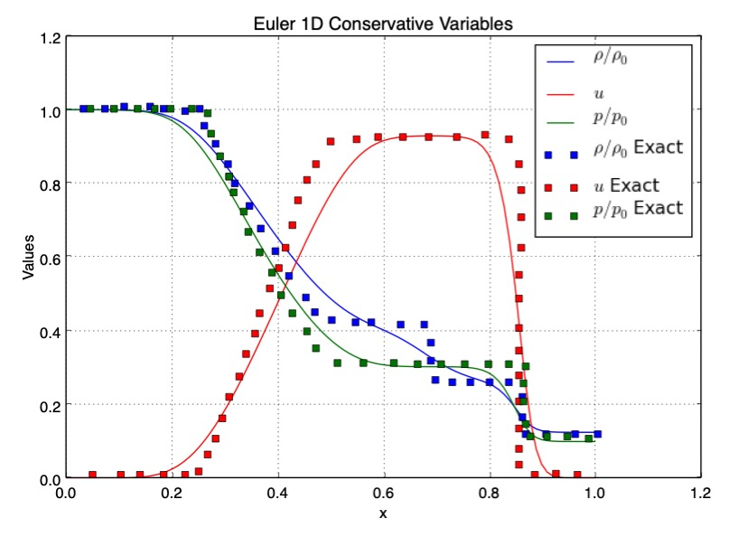

# ShockFXM++

1D Shock Tube simulator demonstrating the use of SplitFXMpp

## What does 'split' mean?
The user is directed to [SplitFXM](https://raw.githubusercontent.com/gpavanb1/SplitFXM/refs/heads/main/README.md) README for further details and documentation

## How to install and execute?

This can be most easily used with VSCode. There is a `tasks.json` that contains the build and run commands that can be invoked directly from the IDE.

The driver program is in `main.cpp` which can be compiled and executed

Note that you would need to install in the `third-party` directory
* [SplitFXM++](https://github.com/gpavanb1/SplitFXMpp) - Clone from [here](https://github.com/gpavanb1/SplitFXMpp)
* [SplitDAE++](https://github.com/gpavanb1/SplitDAEpp) - Clone from [here](https://github.com/gpavanb1/SplitDAEpp)
* [SplitNewton++](https://github.com/gpavanb1/SplitNewtonpp) - Clone from [here](https://github.com/gpavanb1/SplitNewtonpp)

## Benchmark

The code was run with $\Delta$ t = 1e-3 with 100 grid points and backward Euler (to minimize dissipation). Further agreement can be seen with larger grid points and better shock-capturing schemes.

## Whom to contact?

Please direct your queries to [gpavanb1](http://github.com/gpavanb1)
for any questions.

Do join the [SplitFXM Google Group](https://groups.google.com/g/splitfxm) for discussions and updates!